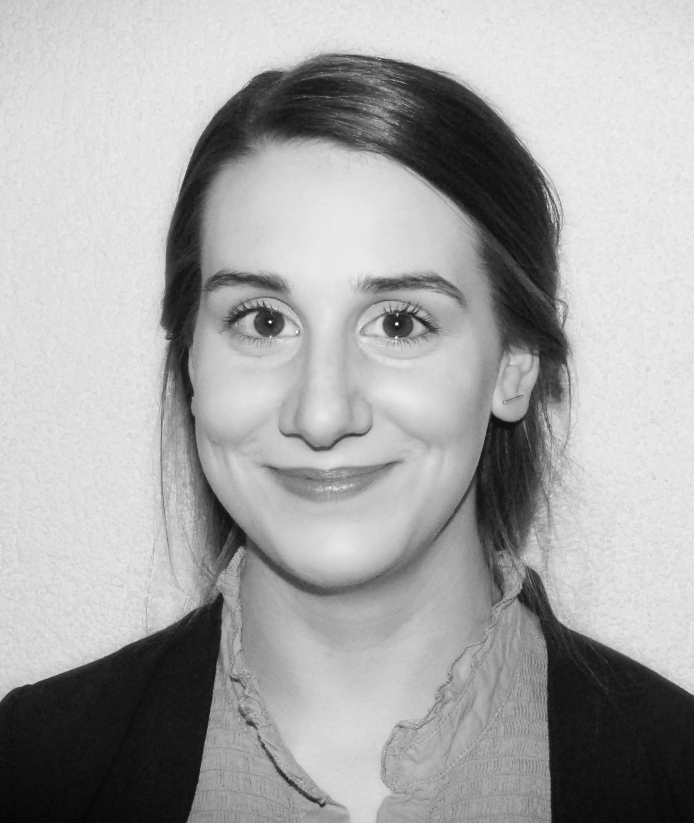

---
# Feel free to add content and custom Front Matter to this file.
# To modify the layout, see https://jekyllrb.com/docs/themes/#overriding-theme-defaults

layout: home
---

 

Christin Katharina Kreutz is a postdoctoral researcher at Cologne University of Applied Sciences (TH Köln) in the <i>Information Retrieval Research</i> group lead by <a href="https://ir.web.th-koeln.de/people/philipp-schaer/">Prof. Dr. Philipp Schaer</a>.
In 2022 she completed her PhD in Computer Science at Trier University under supervision of <a href="https://www.uni-trier.de/en/university/faculties-and-departments/faculty-iv/study-courses/computer-science/chairs/databases-and-information-systems/team/prof-dr-schenkel">Prof. Dr. Ralf Schenkel</a>. 

Her research tackles different aspects related to information systems on bibliographic metadata with a focus on researchers' perspectives such as scholarly recommendation, scientometrics and domain-specific query languages.

Contact: ckreutz (at) acm (dot) org  &#8226; <a href="https://twitter.com/kreutzch">@kreutzch</a>

<strong>Publications</strong>  <a href="https://dblp.org/pid/k/ck.html">[dblp]</a>

<ul>
<li>
<i>RevASIDE: Evaluation of Assignments of Suitable Reviewer Sets for Publications from Fixed Candidate Pools</i> 
Christin Katharina Kreutz, Ralf Schenkel 
Journal of Data Intelligence (to appear) 
<a href="resources/RevASIDE_Journal.pdf">[pdf]</a>
</li>

<li>
<i>SchenQL: A query language for bibliographic data with aggregations and domain-specific functions</i> 
Christin Katharina Kreutz, Martin Blum, Ralf Schenkel 
JCDL 2022: 37:1-37:5 (Demo) 
<a href="https://dl.acm.org/doi/10.1145/3529372.3533282">[pdf]</a> 
<a href="https://youtu.be/pkaKe7vo9ys">[presentation]</a> 
<a href="https://youtu.be/8Y11qdD-Ymc">[minute madness]</a>
</li>

<li>
<i>SchenQL: In-Depth Analysis of a Query Language for Bibliographic Metadata</i> 
Christin Katharina Kreutz, Michael Wolz, Jascha Knack, Benjamin Weyers, Ralf Schenkel 
IJDL 23, pages 113–132 (2022) 
<a href="https://link.springer.com/content/pdf/10.1007/s00799-021-00317-8.pdf">[pdf]</a>
</li>

<li>
<i>Diverse Reviewer Suggestion for Extending Conference Program Committees</i> 
Christin Katharina Kreutz, Krisztian Balog, Ralf Schenkel 
WI-IAT 2021: 79-86 
<a href="https://dl.acm.org/doi/pdf/10.1145/3486622.3493931">[pdf]</a>
<a href="https://github.com/kreutzch/DiveRS">[code]</a>
<a href="https://www.youtube.com/watch?v=0JgLfhDohf0">[presentation]</a>
</li>

<li>
<i>RevASIDE: Assignment of Suitable Reviewer Sets for Publications from Fixed Candidate Pools</i> 
Christin Katharina Kreutz, Ralf Schenkel 
iiWAS 2021: 57–68 
<a href="resources/RevASIDE.pdf">[pdf]</a>
</li>

<li>
<i>SchenQL: Evaluation of a Query Language for Bibliographic Metadata</i> 
Christin Katharina Kreutz, Michael Wolz, Benjamin Weyers, Ralf Schenkel 
ICADL 2020: 323-339 
:trophy: Best Paper Award 
<a href="resources/SchenQL_2020.pdf">[pdf]</a>
<a href="https://www.youtube.com/watch?v=5LCQiePRzHU">[presentation]</a>
</li>

<li>
<i>Segmenting and Clustering Noisy Arguments</i> 
Lorik Dumani, Christin Katharina Kreutz, Manuel Biertz, Alex Witry, Ralf Schenkel 
LWDA 2020: 23-34 
<a href="http://ceur-ws.org/Vol-2738/LWDA2020_paper_24.pdf">[pdf]</a>
</li>

<li>
<i>Evaluating semantometrics from computer science publications</i> 
Christin Katharina Kreutz, Premtim Sahitaj, Ralf Schenkel 
Scientometrics 125(3): 2915-2954 (2020) 
<a href="https://link.springer.com/content/pdf/10.1007/s11192-020-03409-5.pdf">[pdf]</a>
<a href="https://github.com/dbis-trier-university/Semantometrics">[code]</a>
</li>

<li>
<i>SchenQL: A Concept of a Domain-Specific Query Language on Bibliographic Metadata</i> 
Christin Katharina Kreutz, Michael Wolz, Ralf Schenkel 
ICADL 2019: 239-246 
<a href="https://link.springer.com/content/pdf/10.1007%2F978-3-030-34058-2_22.pdf">[pdf]</a>
</li>

<li>
<i>Revaluating Semantometrics from Computer Science Publications</i> 
Christin Katharina Kreutz, Premtim Sahitaj, Ralf Schenkel 
BIRNDL@SIGIR 2019: 42-55 
<a href="http://ceur-ws.org/Vol-2414/paper5.pdf">[pdf]</a>
</li>

<li>
<i>FacetSearch: A Faceted Information Search and Exploration Prototype</i> 
Christin Katharina Kreutz, Peter Boesten, Alex Witry, Ralf Schenkel 
LWDA 2018: 215-226 
<a href="http://ceur-ws.org/Vol-2191/paper26.pdf">[pdf]</a>
<a href="http://data.dws.informatik.uni-mannheim.de/lwda2018/Joint%20Session%201%20Christin%20Katharina%20Kreutz.mp4">[presentation]</a>
</li>

<li>
<i>A Hybrid Approach for Dynamic Topic Models with Fluctuating Number of Topics</i> 
Christin Katharina Kreutz 
Grundlagen von Datenbanken 2018: 35-40 
<a href="http://ceur-ws.org/Vol-2126/paper5.pdf">[pdf]</a>
</li>

<li>
<i>Trend Mining on Bibliographic Data</i> 
Christin Katharina Kreutz 
FDIA 2017 
:trophy: Best Poster Award 
<a href="https://doi.org/10.14236/ewic/FDIA2017.11">[pdf]</a>
</li>
</ul>

**Preprints**

<ul>
<li>
<i>SchenQL: A query language for bibliographic data with aggregations and domain-specific functions</i> 
Christin Katharina Kreutz, Martin Blum, Ralf Schenkel 
<a href="https://arxiv.org/pdf/2205.06513.pdf">[preprint]</a>
</li>

<li>
<i>Diverse Reviewer Suggestion for Extending Conference Program Committees</i> 
Christin Katharina Kreutz, Krisztian Balog, Ralf Schenkel 
<a href="http://arxiv.org/pdf/2201.11030.pdf">[preprint]</a>
</li>

<li>
<i>Scientific Paper Recommendation Systems: a Literature Review of recent Publications</i> 
Christin Katharina Kreutz, Ralf Schenkel 
<a href="https://arxiv.org/pdf/2201.00682.pdf">[preprint]</a>
</li>

<li>
<i>RevASIDE: Assignment of Suitable Reviewer Sets for Publications from Fixed Candidate Pools</i> 
Christin Katharina Kreutz, Ralf Schenkel 
<a href="https://arxiv.org/pdf/2110.02862.pdf">[preprint]</a>
</li>

<li>
<i>SchenQL - A Domain-Specific Query Language on Bibliographic Metadata</i> 
Christin Katharina Kreutz, Michael Wolz, Ralf Schenkel 
<a href="https://arxiv.org/pdf/1906.06132.pdf">[preprint]</a>
</li>
</ul>